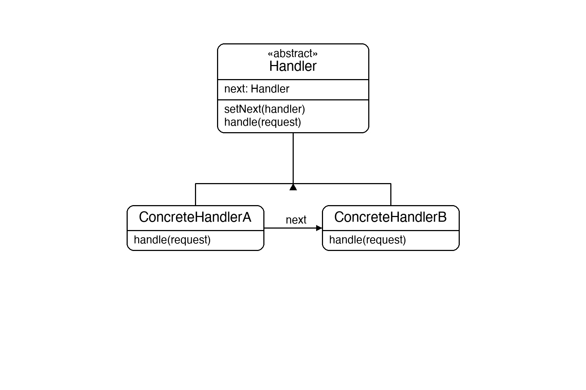
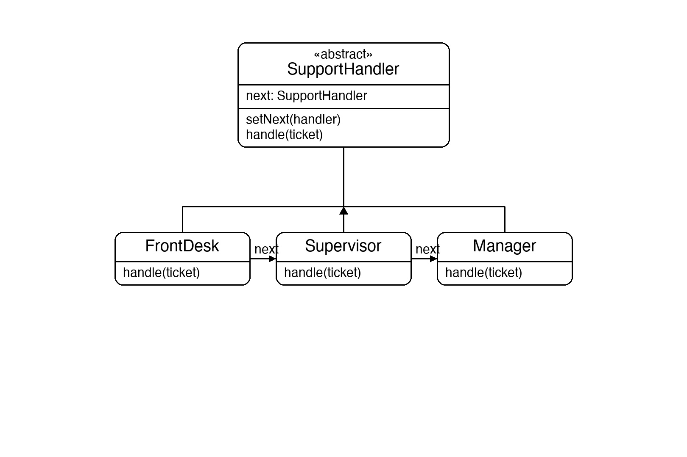

# Documentation of the Code

## Chain of Responsibility Pattern

The Chain of Responsibility pattern is a behavioral design pattern that passes a request along a chain of handlers. Each handler decides either to handle the request or to pass it to the next handler in the chain.

The main idea is to decouple the sender of a request from its receivers. The sender simply fires the request at the first handler; it does not know which handler will ultimately process it. Handlers are linked together, and each one contains a reference to the next. This makes it easy to add, remove, or reorder handlers without touching the sender or the other handlers.

This pattern is useful whenever more than one object may handle a request and the handler is not known up front — for example, support ticket escalation, event handling pipelines, or permission checks.

## Classes in the Code:

### Class SupportTicket
A simple data class representing a support request. It holds an `Id` and a `Priority` (1 = low, 2 = medium, 3 = high). It is the request object passed along the chain.

### Abstract Class SupportHandler
The **Abstract Handler**. It holds a private reference to the next handler (`_next`) and exposes `SetNext` to wire handlers together — it returns the next handler so chains can be built fluently (`a.SetNext(b).SetNext(c)`). The virtual `Handle` method either processes the ticket or forwards it to `_next`. If there is no next handler, it prints an unresolved message.

### Class FrontDesk
A **Concrete Handler** that resolves tickets with priority 1. Anything else is forwarded via `base.Handle(ticket)`.

### Class Supervisor
A **Concrete Handler** that resolves tickets with priority 2. Anything else is forwarded up the chain.

### Class Manager
A **Concrete Handler** that resolves tickets with priority 3. Anything else is forwarded up the chain (resulting in the unresolved message if no further handler exists).

### Class Program
The entry point. It builds the chain `FrontDesk → Supervisor → Manager` and sends four tickets through it — one per known priority level and one with an unknown priority — demonstrating both successful handling and the fallthrough case.

