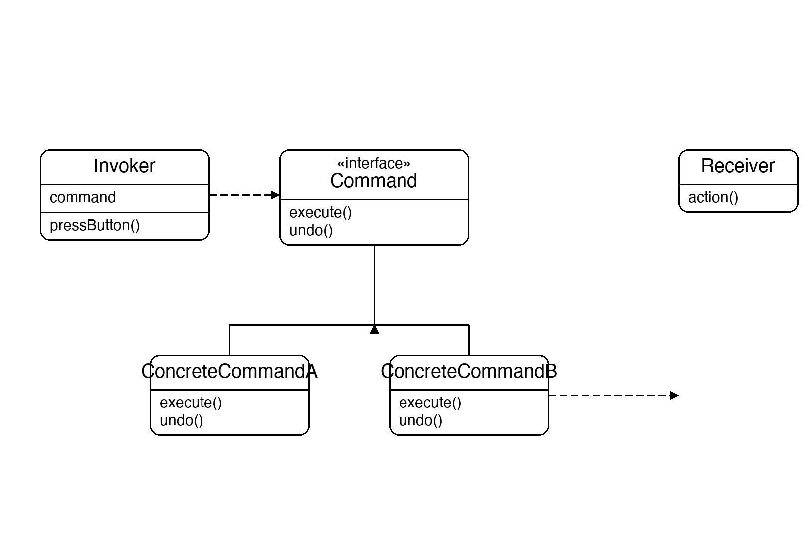
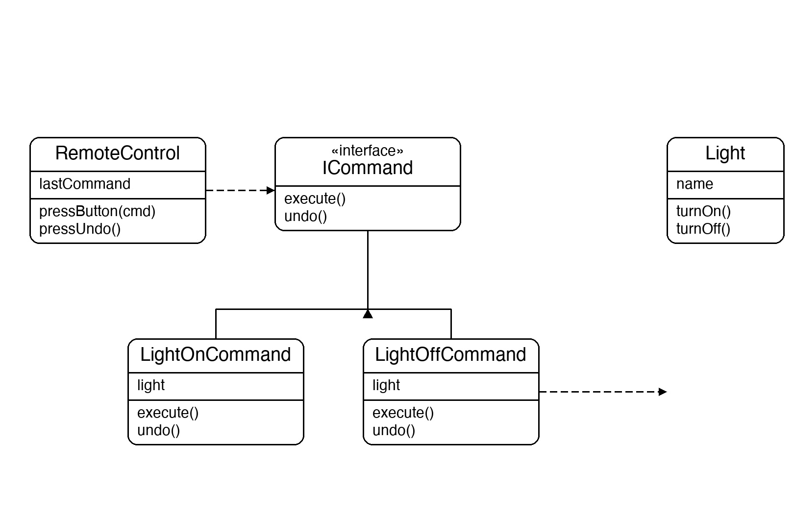

# Documentation of the Code

## Command Pattern

The Command pattern is a behavioral design pattern that turns a request into a stand-alone object. That object contains all the information needed to perform the action — the receiver, the method to call, and any arguments — so it can be passed around, stored, queued, logged, or undone.

The four roles are:
- **Command** — the interface declaring `Execute` and `Undo`
- **Concrete Command** — implements the interface by delegating to a receiver
- **Receiver** — the object that actually knows how to do the work
- **Invoker** — triggers the command without knowing what it does

This pattern is useful whenever you need to parameterise actions, support undo/redo, queue operations, or build transactional systems.

## Classes in the Code:

### Interface ICommand
Defines the two-method contract every command must fulfil: `Execute()` to perform the action and `Undo()` to reverse it.

### Class Light
The **Receiver**. It is the object that knows how to do the actual work — turning a light on or off. Commands hold a reference to a `Light` and delegate all real work to it.

### Class LightOnCommand
A **Concrete Command** that wraps a `Light`. `Execute` calls `TurnOn`; `Undo` calls `TurnOff` to reverse it.

### Class LightOffCommand
A **Concrete Command** that wraps a `Light`. `Execute` calls `TurnOff`; `Undo` calls `TurnOn` to reverse it.

### Class RemoteControl
The **Invoker**. It holds a slot for any `ICommand` and fires it via `PressButton`. It remembers the last command so `PressUndo` can reverse it. It never depends on `Light` or any concrete command — only on the `ICommand` interface.

### Class Program
The entry point. It creates a `Light` (receiver), wraps it in `LightOnCommand` and `LightOffCommand`, then hands those to a `RemoteControl` (invoker). It demonstrates pressing a button and then undoing it, twice.

