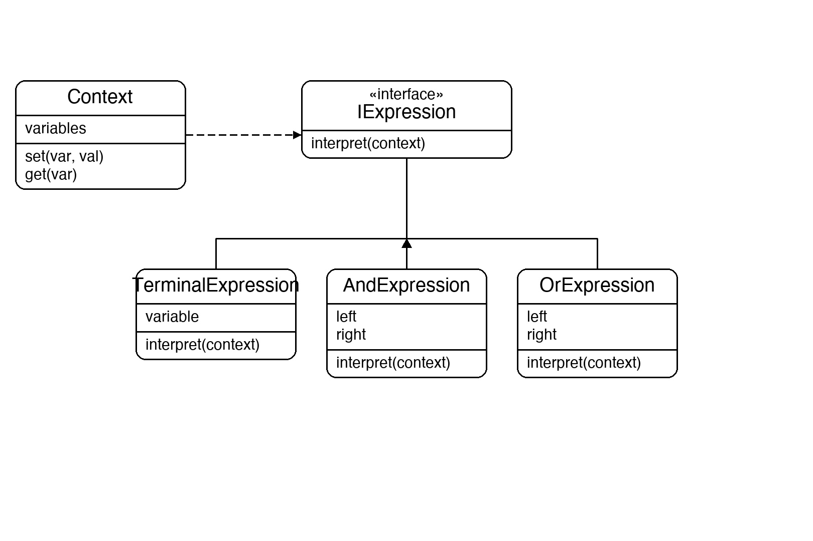
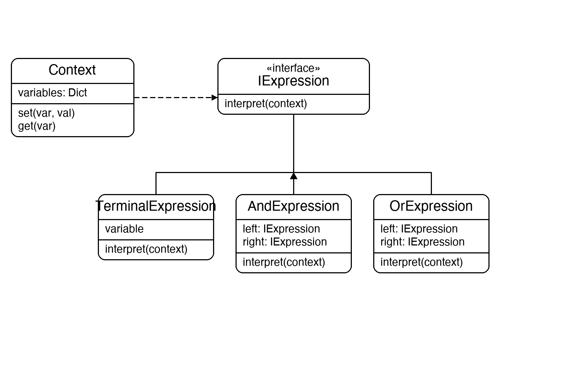

# Documentation of the Code

## Interpreter Pattern

The Interpreter pattern is a behavioral design pattern that defines a grammar for a language and provides an interpreter to evaluate sentences in that language. Each rule in the grammar becomes a class; complex expressions are built by composing simpler ones into a tree.

There are two kinds of expression:
- **Terminal** — a leaf node that directly returns a value (e.g. a variable lookup)
- **Non-terminal** — a composite node that combines two sub-expressions with an operation (e.g. AND, OR)

Calling `Interpret(context)` on the root of the tree recursively evaluates the whole expression. The context holds the variable values the terminals need.

This pattern is useful for building simple language processors, rule engines, query parsers, or any system where you need to evaluate structured expressions at runtime.

## Classes in the Code:

### Class Context
Stores the runtime variable assignments (`A = true`, `B = false`, etc.) in a dictionary. Terminal expressions look up their variable here during evaluation.

### Interface IExpression
Defines the single method `Interpret(Context)` that every expression node must implement. This is what lets the tree be evaluated recursively without knowing the concrete type of each node.

### Class TerminalExpression
A **Terminal** (leaf) expression. It holds a variable name and returns the corresponding boolean value from the context when interpreted. It has no children.

### Class AndExpression
A **Non-terminal** expression. It holds two child `IExpression` references and returns `left.Interpret(context) && right.Interpret(context)`. Composing two `AndExpression` nodes builds a three-way AND.

### Class OrExpression
A **Non-terminal** expression. It holds two child `IExpression` references and returns `left.Interpret(context) || right.Interpret(context)`.

### Class Program
The entry point. It sets up a context with A=true, B=false, C=true, then builds and evaluates two expression trees: `(A AND B) OR C` and `A AND B AND C`. It then mutates the context and re-evaluates to show the same tree produces different results with different variable values.

