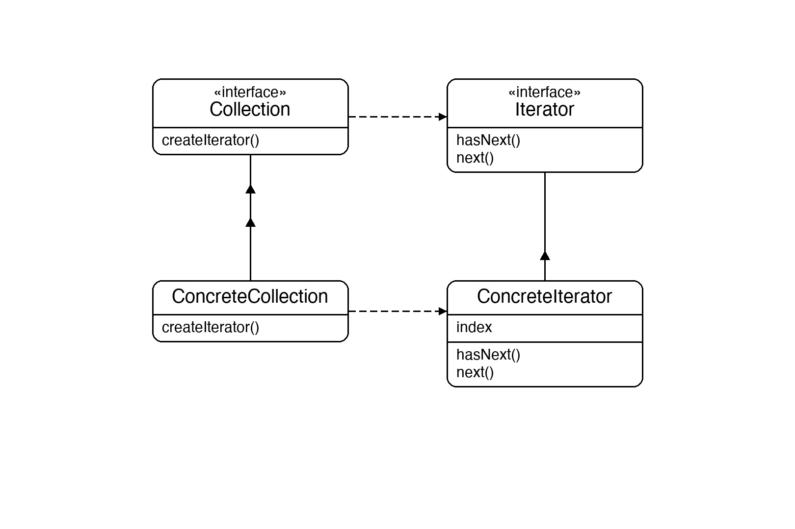
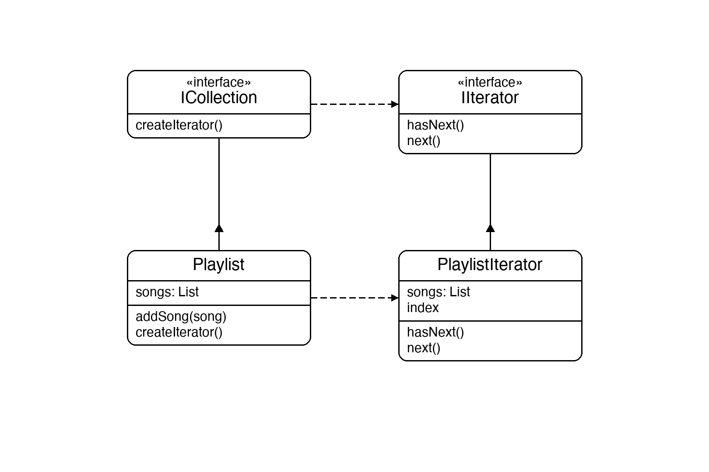

# Documentation of the Code

## Iterator Pattern

The Iterator pattern is a behavioral design pattern that provides a way to sequentially access elements of a collection without exposing its internal structure. The collection and the traversal logic are kept separate.

The two key interfaces are:
- **IIterator** — defines `HasNext()` and `Next()` so any caller can walk through elements without knowing how they are stored.
- **ICollection** — defines `CreateIterator()` so any collection can hand out an iterator.

This pattern is useful whenever you want to traverse a collection in a standard way, support multiple simultaneous traversals, or swap out the collection implementation without touching the traversal code.

## Classes in the Code:

### Interface IIterator
Defines the traversal contract: `HasNext()` returns `true` while elements remain; `Next()` returns the current element and advances the position.

### Interface ICollection
Defines the factory method `CreateIterator()` that the collection implements to return its iterator.

### Class PlaylistIterator
The **Concrete Iterator**. It holds a reference to the song list and an `_index` tracking the current position. `HasNext()` checks whether the index is still within bounds; `Next()` returns the song at the current index and increments it.

### Class Playlist
The **Concrete Collection**. It stores songs in a private `List<string>` and exposes `AddSong` to populate it. `CreateIterator()` wraps the internal list in a `PlaylistIterator` and returns it — the caller never sees the list directly.

### Class Program
The entry point. It builds a `Playlist`, adds three songs, then obtains an iterator and drives it with a `while(HasNext())` loop — demonstrating that traversal requires no knowledge of the underlying data structure.

