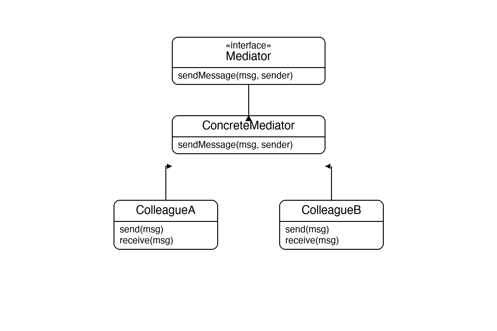
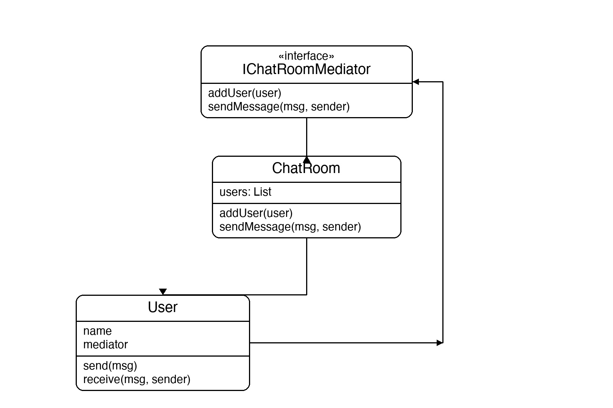

# Documentation of the Code

## Mediator Pattern

The Mediator pattern is a behavioral design pattern that reduces chaotic dependencies between objects by routing all communication through a central mediator object. Instead of colleagues referencing each other directly, they only reference the mediator.

Without a mediator, N colleagues would need up to N×(N-1) direct connections. With a mediator, every colleague has exactly one dependency — the mediator itself — making it easy to add new colleagues or change communication logic without touching any of the other classes.

This pattern is useful in chat applications, air traffic control, UI form coordination, and any system where many objects need to interact without being tightly coupled to each other.

## Classes in the Code:

### Interface IChatRoomMediator
Defines the contract the mediator must fulfil: `AddUser` registers a colleague, and `SendMessage` delivers a message from a sender to all other registered users.

### Class ChatRoom
The **Concrete Mediator**. It maintains the list of registered `User` objects and implements `SendMessage` by iterating over all users and calling `Receive` on everyone except the sender. All routing logic lives here.

### Class User
The **Colleague**. It holds a name and a reference to the mediator — its only dependency. `Send` passes the message to the mediator; `Receive` prints an incoming message. Users never call each other directly.

### Class Program
The entry point. It creates a `ChatRoom`, then creates three `User` objects that each register themselves automatically. Two messages are sent, showing that every other user in the room receives them — all routed through the mediator with zero direct user-to-user coupling.

