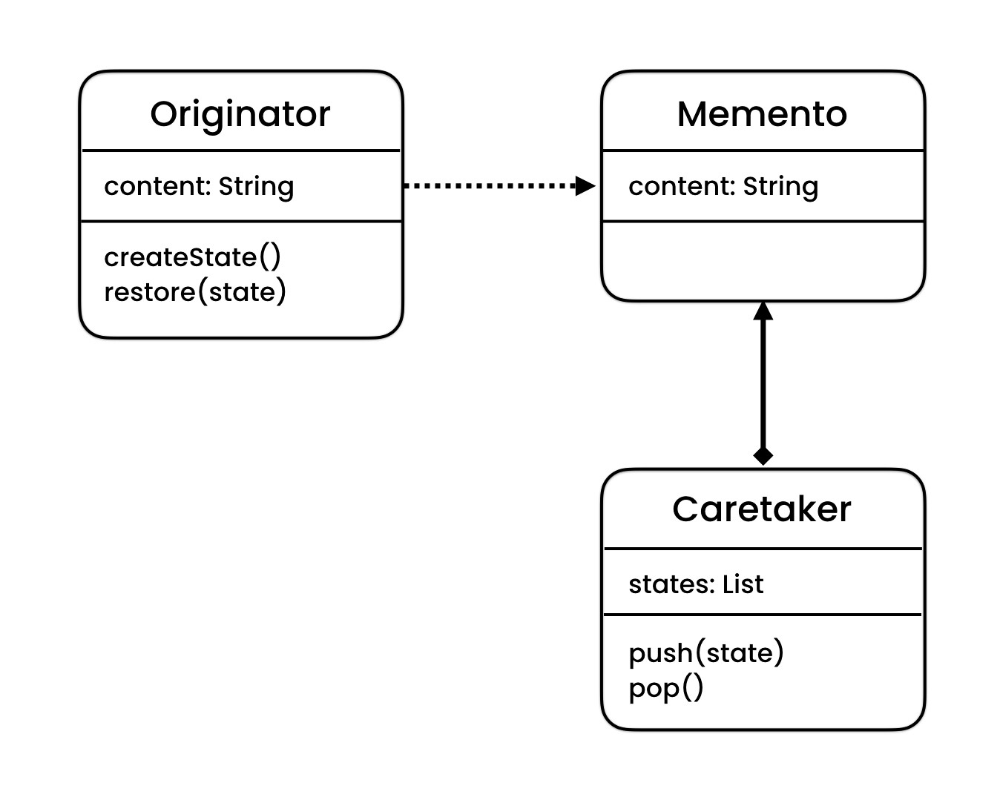
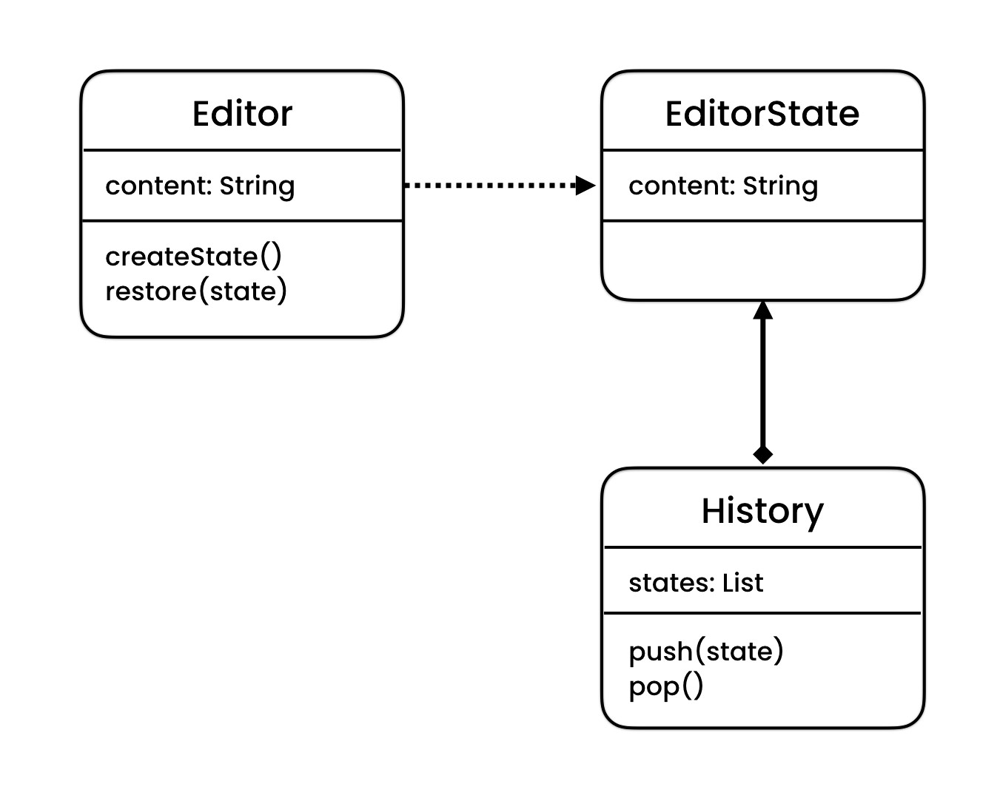

# Documentation of the Code

## Memento Pattern:
The Memento pattern is a software design pattern that provides the ability to restore an object to its previous state (undo via rollback). The Memento pattern is implemented with three objects: the originator, a caretaker, and a memento.

### Originator:
The originator is an object that has an internal state. It creates a memento object capturing its current internal state and returns this memento object to the caretaker. The originator uses the memento object to restore its internal state.

### Caretaker:
The caretaker is an object that is responsible for the memento's safekeeping. It never operates on or examines the contents of a memento.

### Memento:
The memento is an object that stores the originator's current internal state. It is opaque to the caretaker and the originator.

## Classes in the Code:

### Editor:
The class `Editor` represents the Originator in the Memento pattern. It has a public property `Content` which can be set and get. The class has two methods, `CreateState` and `Restore`. The `CreateState` method creates a new instance of the `EditorState` class and returns it. The `Restore` method sets the `Content` property to the value of the `Content` property of the state passed to it.

### EditorState:
The class `EditorState` represents the Memento in the Memento pattern. It has a public read-only property `Content` which holds the value of the `Content` of the `Editor` class. The class has a constructor that accepts a string as a parameter and sets the value of the `Content` property to it.

### History:
The class `History` represents the Caretaker in the Memento pattern. It has a public property `states` of type `List<EditorState>` which holds a list of `EditorState` objects. The class has two methods, `Push`, and `Pop`. The `Push` method adds the `EditorState` object passed to it to the `states` list. The `Pop` method removes the last item from the `states` list and returns it.

### Program:
The class `Program` is the main class of the program. In the `Main` method, an instance of the `Editor` class and an instance of the `History` class is created. The `Content` property of the editor is set to "a", and the `CreateState` method of the editor is called, and the returned `EditorState` object is passed to the `Push` method of the history. The same steps are repeated for "b" and "c". Finally, two calls to the `Restore` method of the editor are made, each time passing the result of a call to the `Pop` method of the history. The final value of the `Content` property of the editor is then printed to the console.

