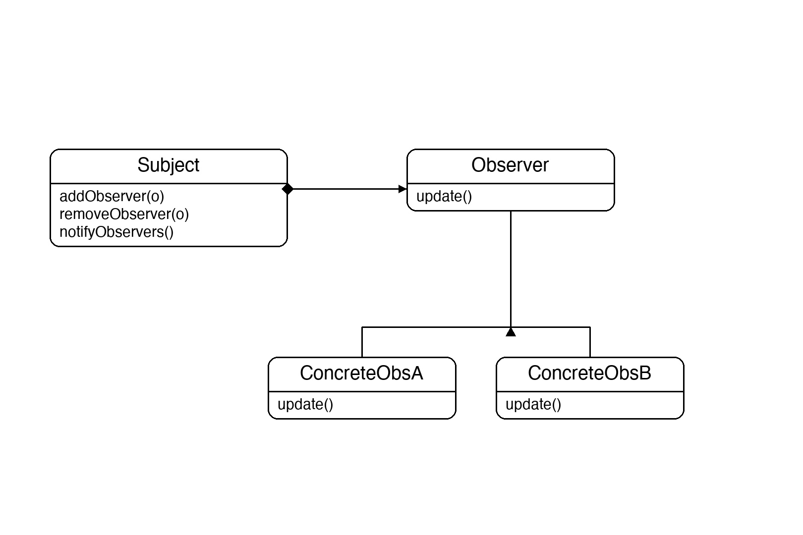
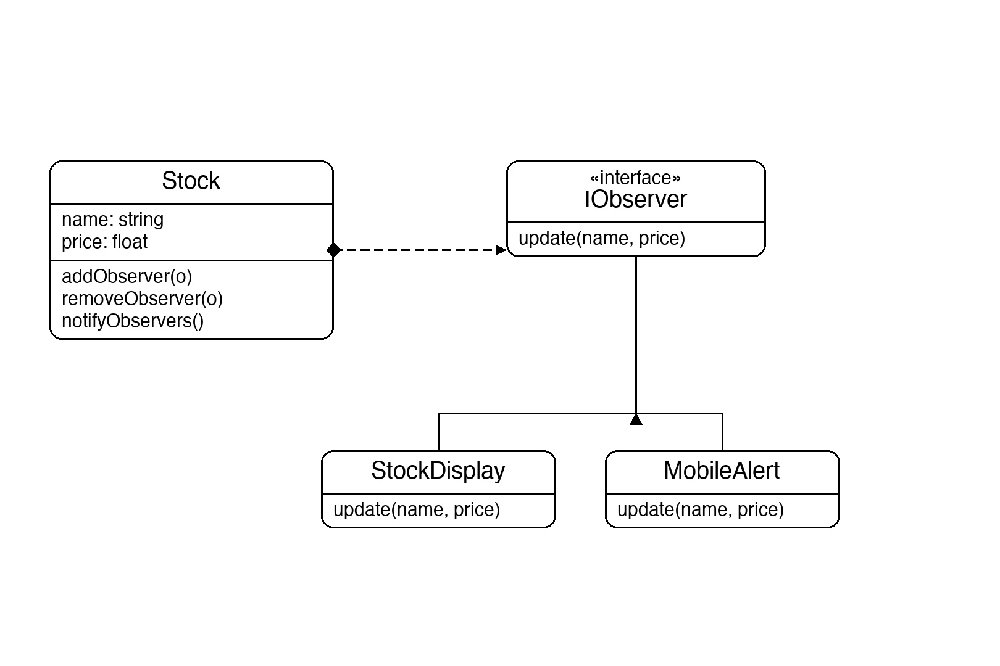

# Documentation of the Code

## Observer Pattern

The Observer pattern is a behavioral design pattern that defines a one-to-many dependency between objects. When one object (the **subject**) changes state, all of its dependents (the **observers**) are notified and updated automatically.

The main idea is to decouple the subject from the observers — the subject only knows that observers implement a common interface; it doesn't care what they do with the update. This makes it easy to add new observers without changing the subject at all.

This pattern is commonly used in event systems, UI frameworks, and any scenario where multiple components need to react to state changes in another component.

## Classes in the Code:

### Interface IObserver
Defines the contract every observer must fulfil. It has a single method `Update(stockName, price)` which the subject calls whenever its state changes.

### Interface ISubject
Defines the contract the subject must fulfil. It declares three methods: `AddObserver` to register an observer, `RemoveObserver` to unregister one, and `NotifyObservers` to push the current state to all registered observers.

### Class Stock
The **Subject**. It implements `ISubject` and holds the stock's `Name` and `Price`. Setting `Price` automatically triggers `NotifyObservers`, so observers are always up to date. It maintains a private list of registered `IObserver` objects.

### Class StockDisplay
A **Concrete Observer** that simulates a stock market screen. When `Update` is called it prints the new price to the console.

### Class MobileAlert
A **Concrete Observer** that simulates a mobile push notification. When `Update` is called it prints an alert message to the console. This observer is unregistered mid-way through the demo to show how observers can unsubscribe at runtime.

### Class Program
The entry point. It creates a `Stock`, registers a `StockDisplay` and a `MobileAlert` as observers, then changes the price three times. After the second change, `MobileAlert` is removed — the third price change only notifies `StockDisplay`, demonstrating dynamic subscription management.

