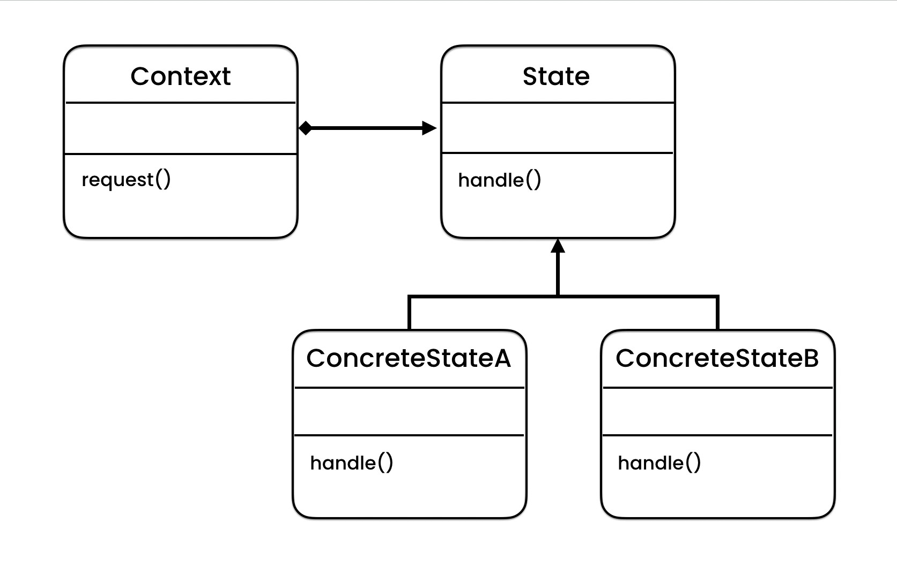
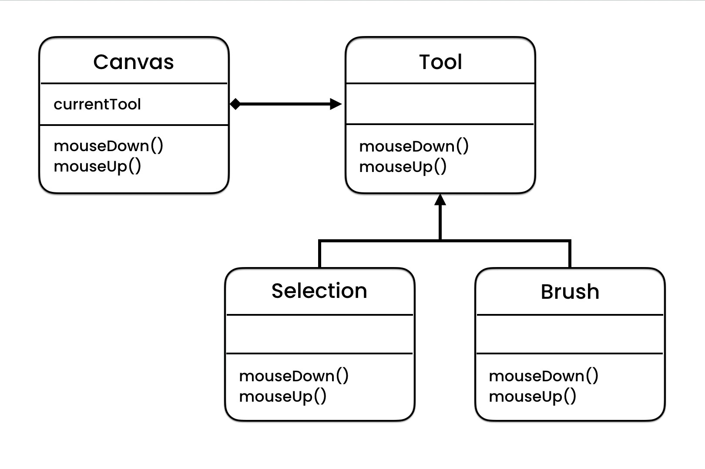

# Documentation of the Code

## State Pattern

The State pattern is a behavioral design pattern that lets an object alter its behavior when its internal state changes. It appears as if the object has changed its class. The pattern consists of a set of state objects, each of which represents a unique state of the system and a context object that transitions between states.

The main idea of the pattern is to allow an object to change its behavior in response to changes in its internal state. Instead of using a large switch statement to determine the behavior of an object, the state pattern uses a set of objects that each define a unique state and its behavior. The context object transitions between these states as needed.

This pattern can be useful when an object's behavior changes dramatically based on its internal state and when it's difficult to manage all of the possible behavior using a large switch statement. The state pattern also helps to separate the behavior of an object into smaller, more manageable parts.

## Classes in the Code:

### Class Canvas
This class is used to handle the mouse events, it has two methods: `MouseDown` and `MouseUp` which are called when the mouse is clicked down and released, respectively. The class also has a property `currentTool` which keeps track of the current tool being used.

### Abstract Class ToolType
This abstract class provides the blueprint for all the tool types. It has two abstract methods `MouseDown` and `MouseUp` which should be implemented by the derived classes.

### Class SelectionTool
This class is derived from `ToolType` and implements the `MouseDown` and `MouseUp` methods, which displays the message for the selection tool.

### Class BrushTool
This class is derived from `ToolType` and implements the `MouseDown` and `MouseUp` methods, which displays the message for the brush tool.

### Class EraserTool
This class is derived from `ToolType` and implements the `MouseDown` and `MouseUp` methods, which displays the message for the eraser tool.

### Class Program
This class contains the `Main` method, where a `Canvas` object is created, and its `currentTool` property is set to an instance of `BrushTool`. The `MouseDown` and `MouseUp` methods are then called on the canvas object.

