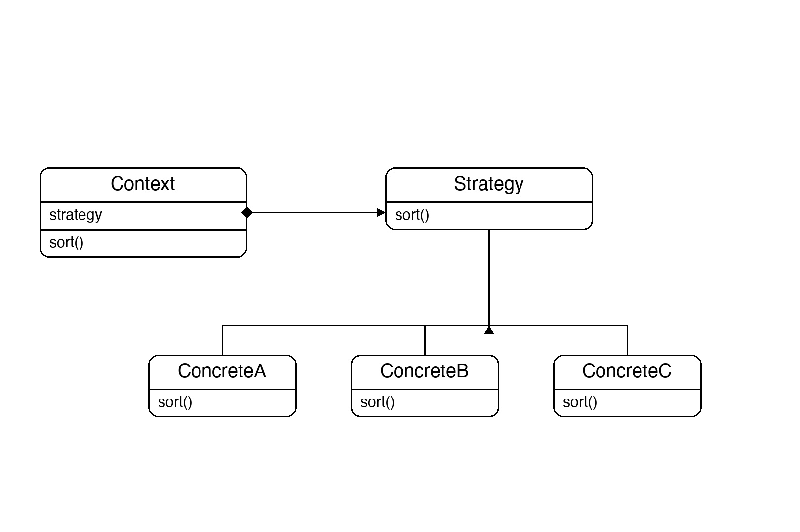
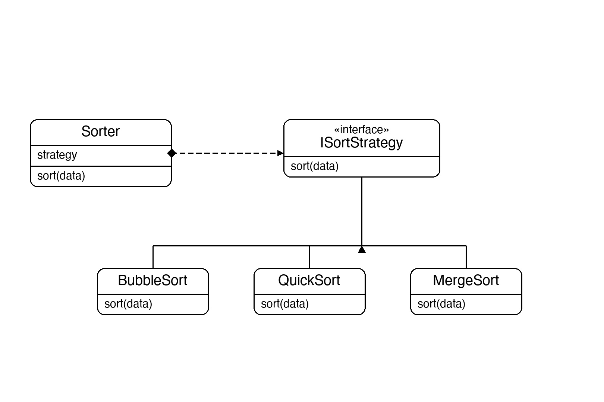

# Documentation of the Code

## Strategy Pattern

The Strategy pattern is a behavioral design pattern that defines a family of algorithms, encapsulates each one in its own class, and makes them interchangeable. The context delegates the work to a strategy object instead of implementing the algorithm itself.

The main benefit is that the algorithm used by a context can be swapped at runtime without changing the context's code. This replaces complex conditional logic (`if useQuickSort ... else if useBubbleSort ...`) with a clean object swap.

This pattern is useful whenever you have multiple variations of an algorithm and want to choose or switch between them dynamically — for example, different sorting algorithms, compression formats, or payment methods.

## Classes in the Code:

### Interface ISortStrategy
Defines the contract every sorting strategy must fulfil. It has a single method `Sort(data)` which accepts a `List<int>` and sorts it in place.

### Class BubbleSort
A **Concrete Strategy** that implements `ISortStrategy`. It sorts the list using the Bubble Sort algorithm — repeatedly swapping adjacent out-of-order elements until the list is sorted.

### Class QuickSort
A **Concrete Strategy** that implements `ISortStrategy`. It sorts the list using the Quick Sort algorithm — partitioning the list around a pivot and recursively sorting each partition.

### Class MergeSort
A **Concrete Strategy** that implements `ISortStrategy`. It sorts the list using the Merge Sort algorithm — recursively splitting the list in half, sorting each half, then merging them back together.

### Class Sorter
The **Context**. It holds a reference to an `ISortStrategy` and delegates all sorting work to it via `Sort(data)`. The strategy can be replaced at any time by setting the `Strategy` property — the `Sorter` class itself never changes.

### Class Program
The entry point. It creates a `Sorter` with `BubbleSort`, sorts a list, then swaps to `QuickSort` and sorts another list, then swaps to `MergeSort` for a third. This demonstrates that the context works identically regardless of which strategy is assigned.

