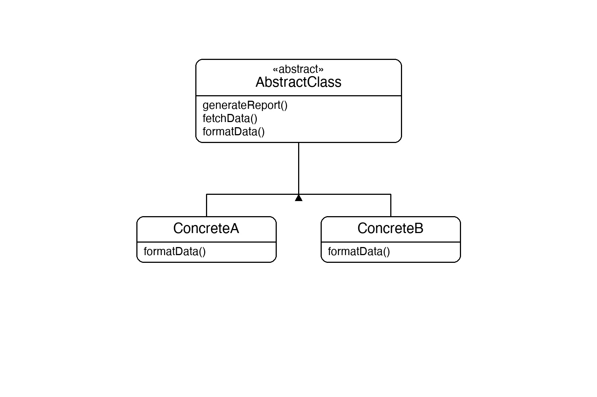
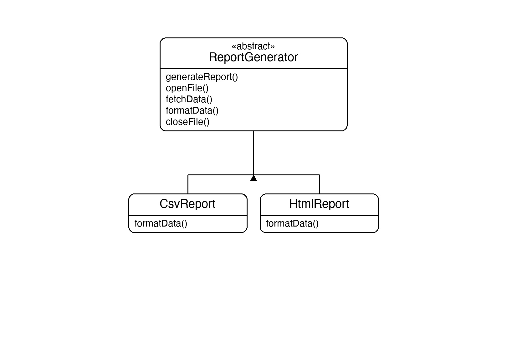

# Documentation of the Code

## Template Method Pattern

The Template Method pattern is a behavioral design pattern that defines the skeleton of an algorithm in a base class, deferring some steps to subclasses. The overall sequence of steps is fixed — only specific steps can be overridden.

The key idea is the **template method**: a method in the abstract class that calls the steps in order. Shared steps are implemented once in the base class; variable steps are declared `abstract` so each subclass provides its own version. Subclasses fill in the blanks without being allowed to reorder the algorithm.

This pattern is useful whenever multiple classes follow the same sequence of steps but differ in one or a few of them — for example, generating reports in different formats, processing files with different parsers, or building UI components with different rendering logic.

## Classes in the Code:

### Abstract Class ReportGenerator
The **Abstract Class** that contains the template method `GenerateReport()`. It defines the fixed four-step algorithm: `OpenFile` → `FetchData` → `FormatData` → `CloseFile`. The first, second, and fourth steps are `private` (shared, cannot be changed). `FormatData` is `abstract`, forcing each subclass to provide its own implementation. `GenerateReport` is `sealed` so subclasses cannot override the algorithm order.

### Class CsvReport
A **Concrete Class** that extends `ReportGenerator` and overrides `FormatData` to output data in CSV format (`id,name,value`). All other steps are inherited unchanged.

### Class HtmlReport
A **Concrete Class** that extends `ReportGenerator` and overrides `FormatData` to output data wrapped in an HTML table. All other steps are inherited unchanged.

### Class Program
The entry point. It creates a `CsvReport` and an `HtmlReport`, calls `GenerateReport()` on each, and shows that the opening, fetching, and closing steps are identical while only the formatting output differs.

