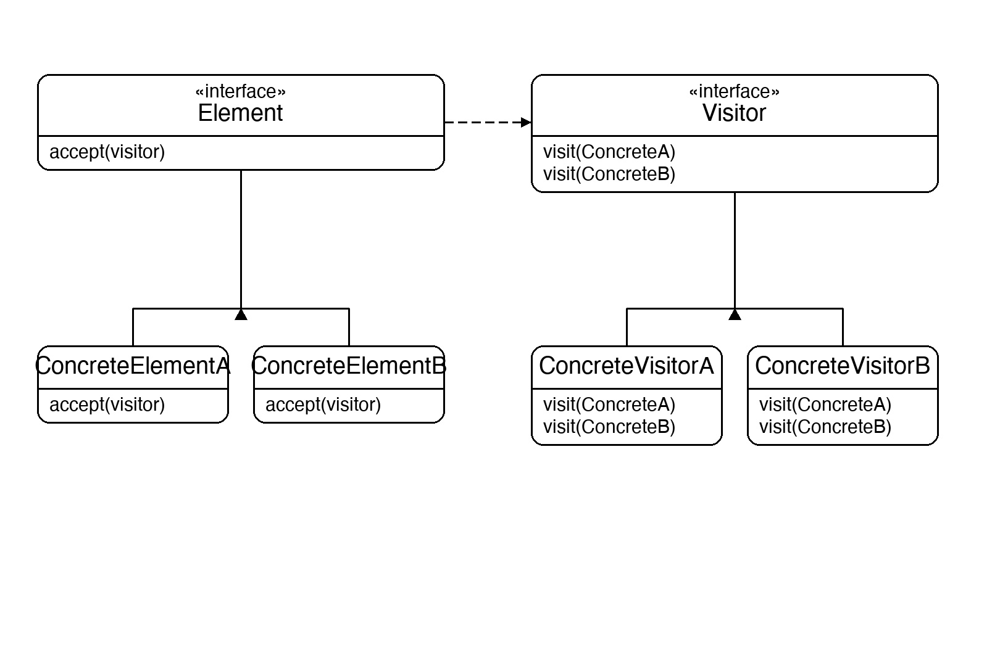
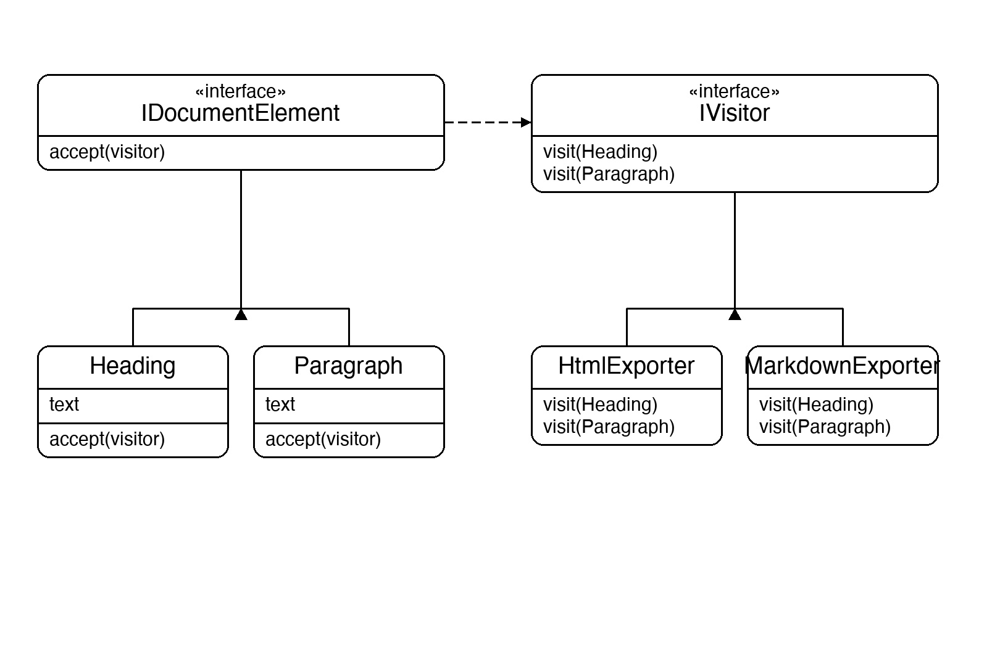

# Documentation of the Code

## Visitor Pattern

The Visitor pattern is a behavioral design pattern that lets you add new operations to a class hierarchy without modifying those classes. The operation logic is moved into a separate visitor object; each element in the hierarchy simply accepts the visitor and calls the right method on it.

The key mechanism is **double dispatch**: when `element.Accept(visitor)` is called, the element calls back `visitor.Visit(this)`, passing its concrete type. This resolves to the correct `Visit` overload at runtime without any casting or `if`/`switch` on types.

This pattern is useful whenever you have a stable set of element types but frequently need to add new operations over them — for example, exporting a document to different formats, running different analysis passes over an AST, or generating reports from a data model.

## Classes in the Code:

### Interface IDocumentElement
Defines the contract all elements must fulfil: a single `Accept(IVisitor)` method. Each concrete element calls back `visitor.Visit(this)` inside `Accept`, triggering the correct overload.

### Interface IVisitor
Defines one `Visit` overload per element type — `Visit(Heading)` and `Visit(Paragraph)`. Adding a new export format means adding a new class that implements this interface, with zero changes to the elements.

### Class Heading
A **Concrete Element** holding a heading text string. Its `Accept` calls `visitor.Visit(this)`, which resolves to `Visit(Heading)`.

### Class Paragraph
A **Concrete Element** holding a paragraph text string. Its `Accept` calls `visitor.Visit(this)`, which resolves to `Visit(Paragraph)`.

### Class HtmlExporter
A **Concrete Visitor** that renders `Heading` as `<h1>` and `Paragraph` as `
`.

### Class MarkdownExporter
A **Concrete Visitor** that renders `Heading` as `# text` and `Paragraph` as plain text.

### Class Program
The entry point. It builds a document list of `Heading` and `Paragraph` elements, then passes the same list through `HtmlExporter` and `MarkdownExporter` — showing that the elements are untouched and the output format is entirely determined by which visitor is used.

