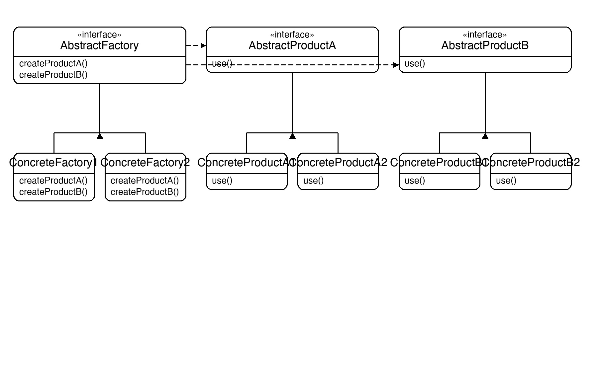
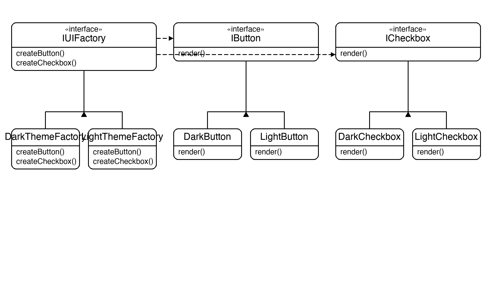

# Documentation of the Code

## Abstract Factory Pattern

The Abstract Factory pattern is a creational design pattern that provides an interface for creating **families** of related objects without specifying their concrete classes. Where Factory Method creates one product, Abstract Factory creates multiple related products that are guaranteed to be compatible with each other.

The key idea is that the client only ever talks to the factory interface and the product interfaces. Swapping the concrete factory swaps the entire product family in one place — the client code is untouched.

This pattern is useful whenever a system must be independent of how its products are created, and products come in families that must be used together (e.g. UI themes, cross-platform widgets, database drivers).

## Classes in the Code:

### Interface IButton
**Abstract Product A** — declares `Render()` for all button variants.

### Interface ICheckbox
**Abstract Product B** — declares `Render()` for all checkbox variants.

### Interface IUIFactory
The **Abstract Factory**. Declares `CreateButton()` and `CreateCheckbox()` — one method per product type. Every concrete factory implements both, guaranteeing the products it creates belong to the same theme.

### Class DarkButton / DarkCheckbox
**Concrete Products** for the dark theme. Each prints a dark-theme render message.

### Class LightButton / LightCheckbox
**Concrete Products** for the light theme. Each prints a light-theme render message.

### Class DarkThemeFactory
A **Concrete Factory** that implements `IUIFactory` and returns `DarkButton` and `DarkCheckbox`.

### Class LightThemeFactory
A **Concrete Factory** that implements `IUIFactory` and returns `LightButton` and `LightCheckbox`.

### Class Application
The **Client**. It accepts any `IUIFactory` in its constructor, creates the widgets through it, and renders them. It has no knowledge of `DarkButton`, `LightButton`, or any concrete type.

### Class Program
The entry point. It creates two `Application` instances — one with `DarkThemeFactory` and one with `LightThemeFactory` — showing that the entire widget family switches with a single factory swap.

