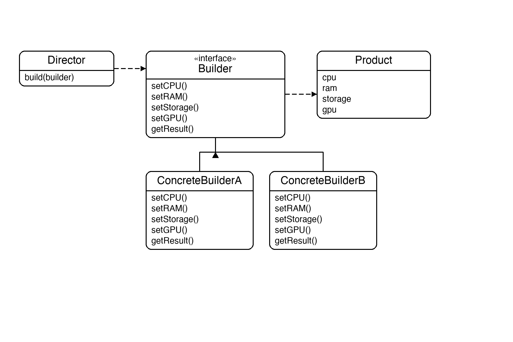
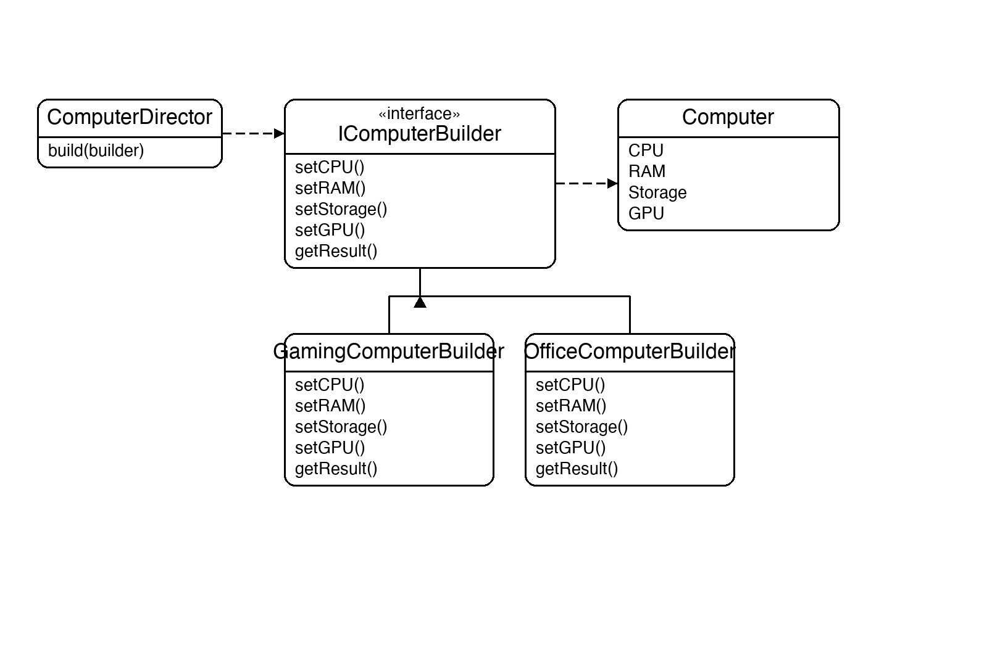

# Documentation of the Code

## Builder Pattern

The Builder pattern is a creational design pattern that constructs a complex object step by step. It separates the construction process from the representation, so the same construction steps can produce different objects.

The four roles are:
- **Product** — the complex object being built
- **Builder** — interface declaring each construction step
- **Concrete Builder** — implements the steps for a specific variant
- **Director** — controls the order of steps; clients can also call steps directly without a director

This pattern is useful whenever an object requires many construction steps and you want to produce different representations using the same process — for example, assembling different computer configurations, building different document formats, or constructing complex query objects.

## Classes in the Code:

### Class Computer
The **Product**. Holds four parts — `CPU`, `RAM`, `Storage`, and `GPU` — and a `ShowSpecs()` method to print them.

### Interface IComputerBuilder
The **Builder**. Declares one method per construction step (`SetCPU`, `SetRAM`, `SetStorage`, `SetGPU`) plus `GetResult()` to return the finished product.

### Class GamingComputerBuilder
A **Concrete Builder** that fills in high-end specs: Core i9, 32GB DDR5, 2TB NVMe SSD, RTX 4090.

### Class OfficeComputerBuilder
A **Concrete Builder** that fills in budget specs: Core i5, 16GB DDR4, 512GB SSD, integrated graphics.

### Class ComputerDirector
The **Director**. Its `Build` method calls the four construction steps in the correct order. It works with any builder that implements `IComputerBuilder`.

### Class Program
The entry point. It creates one `ComputerDirector` and uses it with both builders, then calls `GetResult().ShowSpecs()` to print each computer — demonstrating that the same director produces completely different products depending on the builder supplied.

