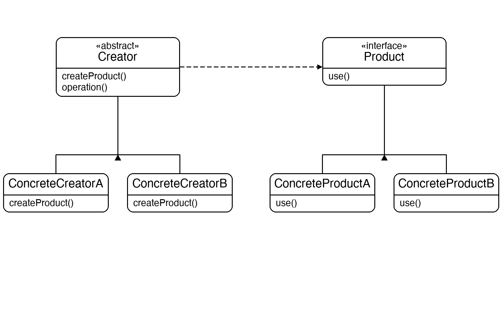
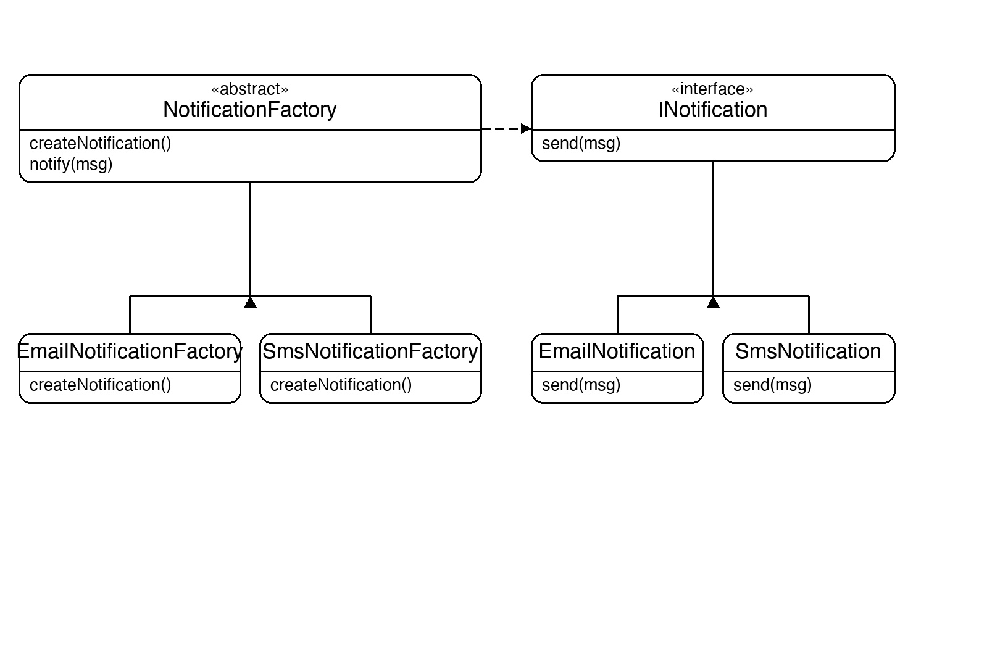

# Documentation of the Code

## Factory Method Pattern

The Factory Method pattern is a creational design pattern that defines an interface for creating an object but lets subclasses decide which class to instantiate. The creator never uses `new` on a concrete product — it delegates that decision to the factory method.

The key idea is that client code works entirely through the abstract creator and the product interface. Swapping to a different product means substituting a different concrete creator — nothing else changes.

This pattern is useful whenever the exact type of object to create is determined by a subclass, or when you want to centralise and encapsulate object creation so it can be varied independently.

## Classes in the Code:

### Interface INotification
The **Product** interface. Defines `Send(message)` — the only method the creator ever calls on the product it creates.

### Class EmailNotification
A **Concrete Product** that implements `INotification`. Prints the message prefixed with `Email:`.

### Class SmsNotification
A **Concrete Product** that implements `INotification`. Prints the message prefixed with `SMS:`.

### Abstract Class NotificationFactory
The **Abstract Creator**. Declares the abstract factory method `CreateNotification()`. Its `Notify` method calls `CreateNotification()` to get a product and then calls `Send` on it — never referencing a concrete class.

### Class EmailNotificationFactory
A **Concrete Creator** that overrides `CreateNotification()` to return a new `EmailNotification`.

### Class SmsNotificationFactory
A **Concrete Creator** that overrides `CreateNotification()` to return a new `SmsNotification`.

### Class Program
The entry point. It holds a `NotificationFactory` reference, assigns it an `EmailNotificationFactory`, calls `Notify`, then swaps to `SmsNotificationFactory` and calls `Notify` again — demonstrating that the calling code never changes when the product type changes.

