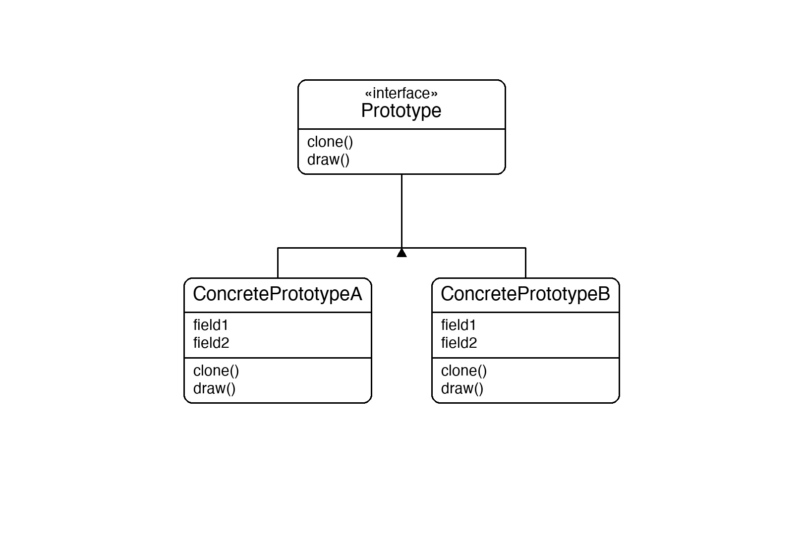
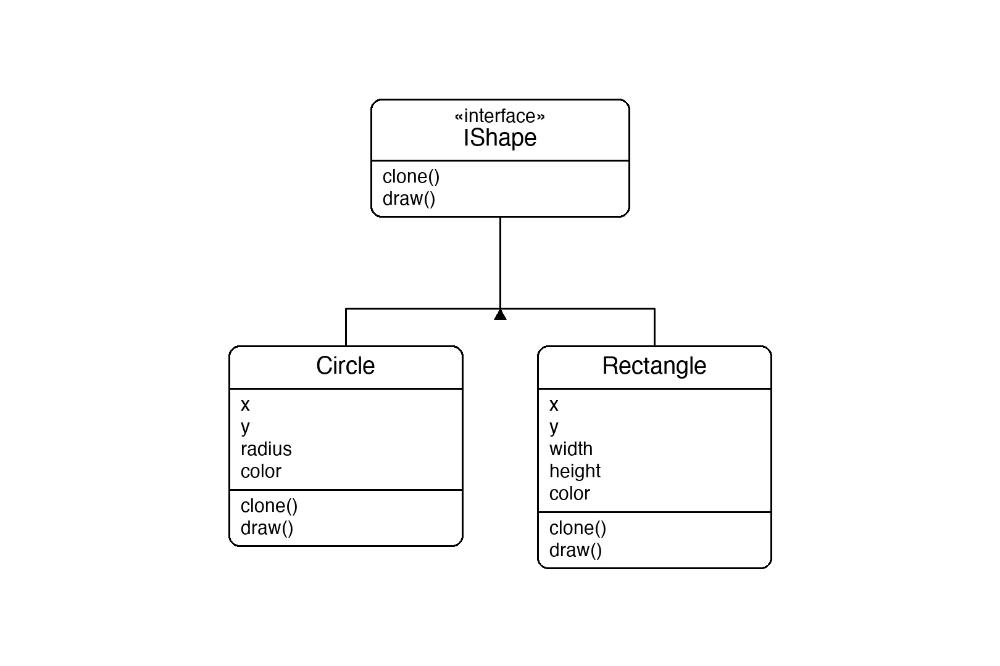

# Documentation of the Code

## Prototype Pattern

The Prototype pattern is a creational design pattern that creates new objects by copying (cloning) an existing object instead of constructing one from scratch. The clone is an independent copy — mutating it does not affect the original.

The key idea is that the object knows how to copy itself. The client calls `Clone()` on a prototype and receives a ready-made object of the same type and state, without needing to know the concrete class at all.

This pattern is useful when object creation is expensive, when you want to avoid subclassing just to vary configuration, or when the type of the object to create is only known at runtime.

## Classes in the Code:

### Interface IShape
The **Prototype** interface. Declares `Clone()` (returns an independent copy of the object) and `Draw()` (displays properties). Any class that implements this can be cloned without the caller knowing its concrete type.

### Class Circle
A **Concrete Prototype**. Holds `X`, `Y`, `Radius`, and `Color`. Its `Clone()` constructs a new `Circle` with the same values — a deep copy since all fields are value types or immutable strings.

### Class Rectangle
A **Concrete Prototype**. Holds `X`, `Y`, `Width`, `Height`, and `Color`. Its `Clone()` constructs a new `Rectangle` with the same values.

### Class Program
The entry point. It creates a `Circle` and a `Rectangle`, clones each one, then mutates the clones. It prints the originals before and after to show they are completely unaffected — proving the clones are independent objects.

