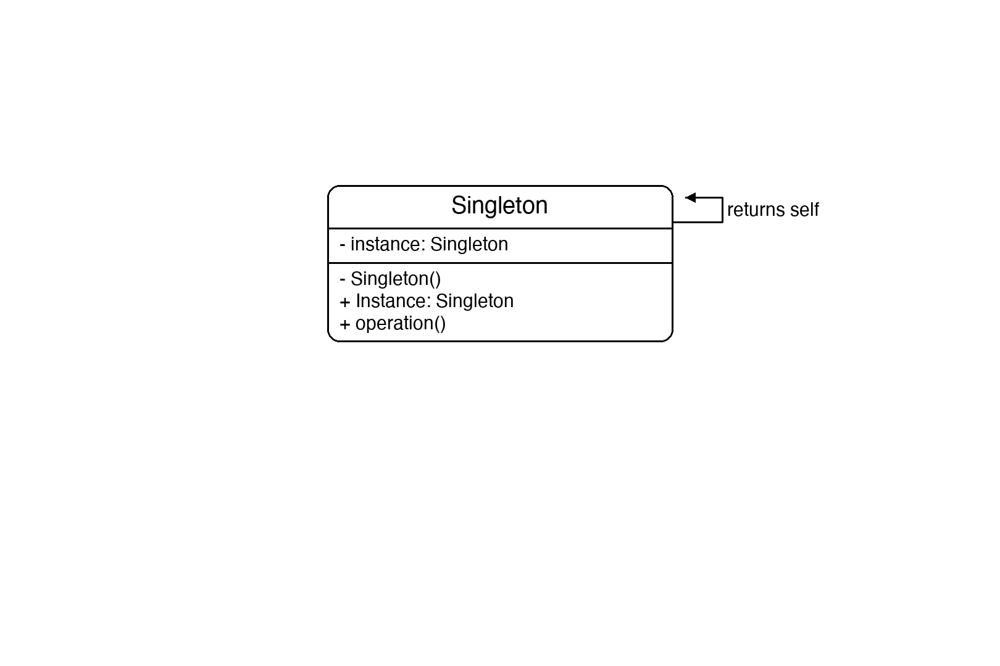
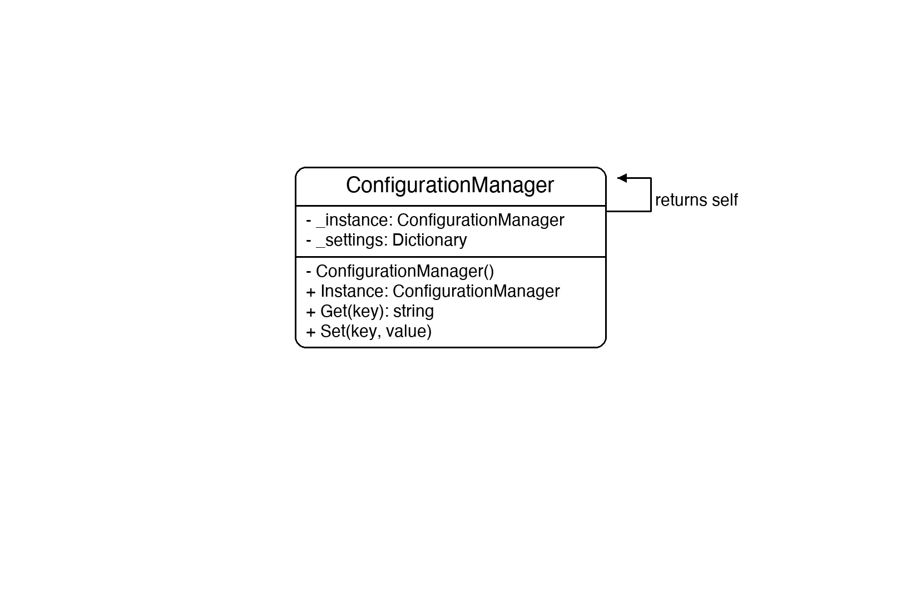

# Documentation of the Code

## Singleton Pattern

The Singleton pattern is a creational design pattern that ensures a class has only one instance and provides a global access point to it.

The key mechanism is a private constructor (so nothing outside the class can call `new`) combined with a static property that creates the instance on first access and returns the same one on every subsequent call. Double-checked locking makes this safe when multiple threads access `Instance` simultaneously.

This pattern is useful for resources that must be shared and should exist only once — for example, configuration managers, logging services, connection pools, or caches.

## Classes in the Code:

### Class ConfigurationManager
The **Singleton**. Its constructor is `private`, so the only way to obtain an instance is through the static `Instance` property. The property uses double-checked locking to create the object exactly once. It stores settings in a private dictionary and exposes `Get` and `Set` to read and update them.

### Class Program
The entry point. It calls `ConfigurationManager.Instance` twice, storing the result in `config1` and `config2`. `ReferenceEquals` confirms they are the same object. A setting changed through `config2` is immediately visible through `config1`, proving there is only one instance.

