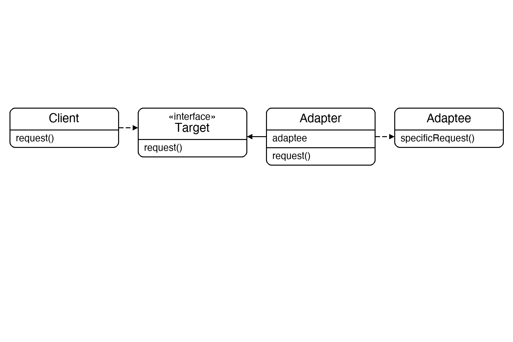
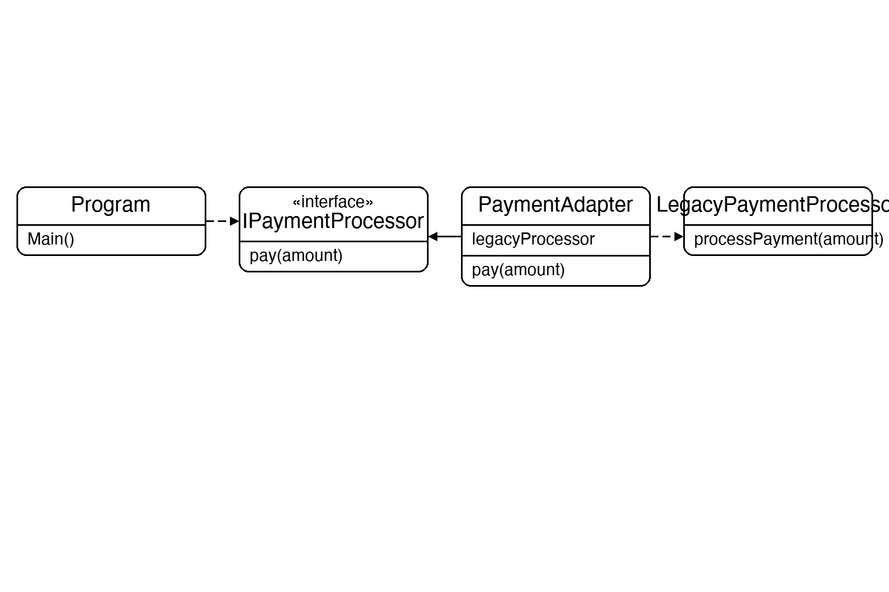

# Documentation of the Code

## Adapter Pattern

The Adapter pattern is a structural design pattern that allows objects with incompatible interfaces to work together. It wraps an existing class in a new interface that the client expects, without modifying either the client or the wrapped class.

The key idea is that the adapter acts as a translator — it receives a call in the format the client understands and forwards it to the adaptee in the format it understands. Neither side needs to change.

This pattern is useful when integrating third-party libraries, working with legacy code, or combining systems that were built independently and have different interfaces.

## Classes in the Code:

### Interface IPaymentProcessor
The **Target** interface — what the client expects. Declares `Pay(amount)`.

### Class LegacyPaymentProcessor
The **Adaptee** — an existing class with an incompatible method name `ProcessPayment(amount)`. It cannot be modified.

### Class PaymentAdapter
The **Adapter**. Implements `IPaymentProcessor` and holds a reference to a `LegacyPaymentProcessor`. Its `Pay` method simply delegates to `_legacyProcessor.ProcessPayment`, bridging the interface gap.

### Class Program
The entry point. It creates a `LegacyPaymentProcessor`, wraps it in a `PaymentAdapter`, and assigns it to an `IPaymentProcessor` reference. The client calls `Pay()` — it has no knowledge of the legacy system underneath.

