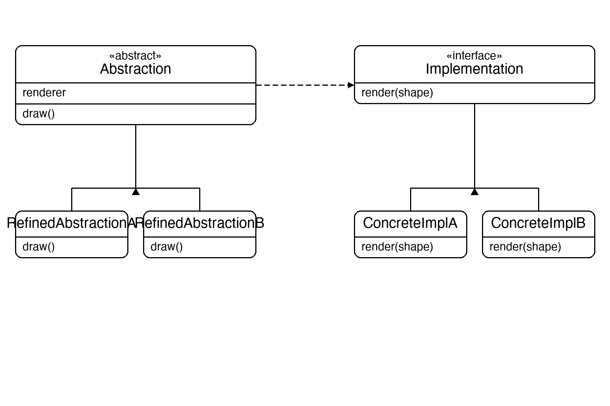
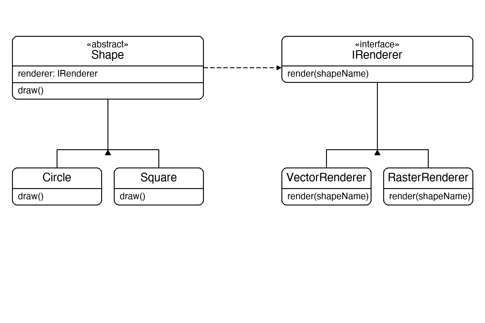

# Documentation of the Code

## Bridge Pattern

The Bridge pattern is a structural design pattern that splits a large class (or set of closely related classes) into two separate hierarchies — **abstraction** and **implementation** — which can be developed and extended independently.

Without Bridge, combining N shapes with M renderers would require N×M subclasses. With Bridge, you have N shape classes and M renderer classes — N+M total — and any combination is possible at runtime.

The bridge is the reference the abstraction holds to the implementation. Changing the implementation (renderer) does not require changing the abstraction (shape) and vice versa.

This pattern is useful whenever you want to avoid a permanent binding between an abstraction and its implementation, or whenever both dimensions need to be extensible independently.

## Classes in the Code:

### Interface IRenderer
The **Implementation** interface. Declares `Render(shapeName)` — the single method all renderers must provide.

### Class VectorRenderer
A **Concrete Implementation** that renders shapes as vector graphics.

### Class RasterRenderer
A **Concrete Implementation** that renders shapes as raster pixels.

### Abstract Class Shape
The **Abstraction**. Holds a protected `_renderer` reference (the bridge) injected via constructor. Declares abstract `Draw()` which subclasses implement.

### Class Circle
A **Refined Abstraction**. Implements `Draw()` by calling `_renderer.Render("Circle")`.

### Class Square
A **Refined Abstraction**. Implements `Draw()` by calling `_renderer.Render("Square")`.

### Class Program
The entry point. It creates all four shape+renderer combinations (Circle/Square × Vector/Raster) and calls `Draw()` on each, showing that shapes and renderers vary independently with no new subclasses needed.

