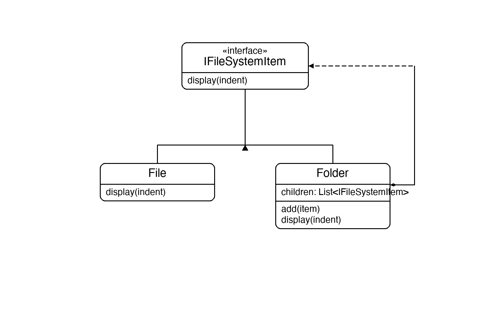

# Documentation of the Code

## Composite Pattern

The Composite pattern is a structural design pattern that lets you compose objects into tree structures and then work with those structures as if they were individual objects. Both individual objects (leaves) and collections (composites) implement the same interface, so the client treats them uniformly.

The key idea is that the composite stores a list of children — each child can itself be a leaf or another composite. Calling an operation on the root recursively propagates down the entire tree without the caller needing to distinguish between leaves and nodes.

This pattern is useful whenever you have a part-whole hierarchy: file systems, UI component trees, organisation charts, menu systems, or any recursive structure.

## Classes in the Code:

### Interface IFileSystemItem
The **Component** — the common interface for all items in the tree. Declares `Display(indent)`.

### Class File
The **Leaf**. Has no children. `Display` prints its own name with the given indentation.

### Class Folder
The **Composite**. Holds a list of `IFileSystemItem` children (which can be `File`s or other `Folder`s). `Add` inserts a child; `Display` prints its own name then recursively calls `Display` on every child with increased indentation.

### Class Program
The entry point. Builds a two-level folder tree (`root/src/`, `root/docs/`, plus a loose file), then calls `root.Display("")` once — the recursion does the rest.

