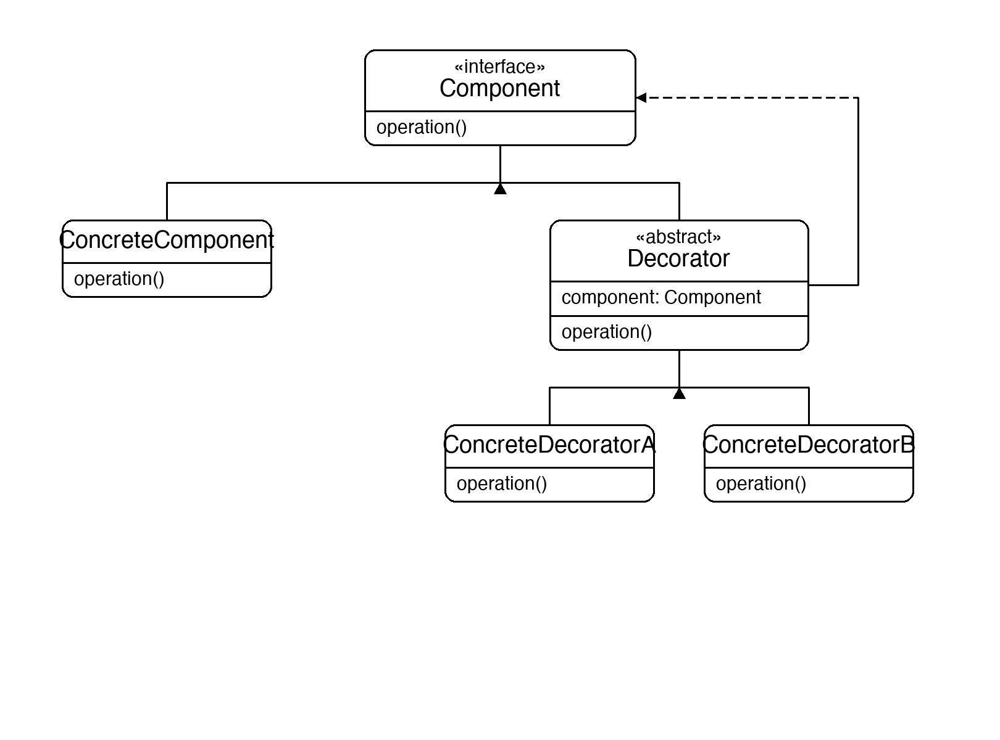
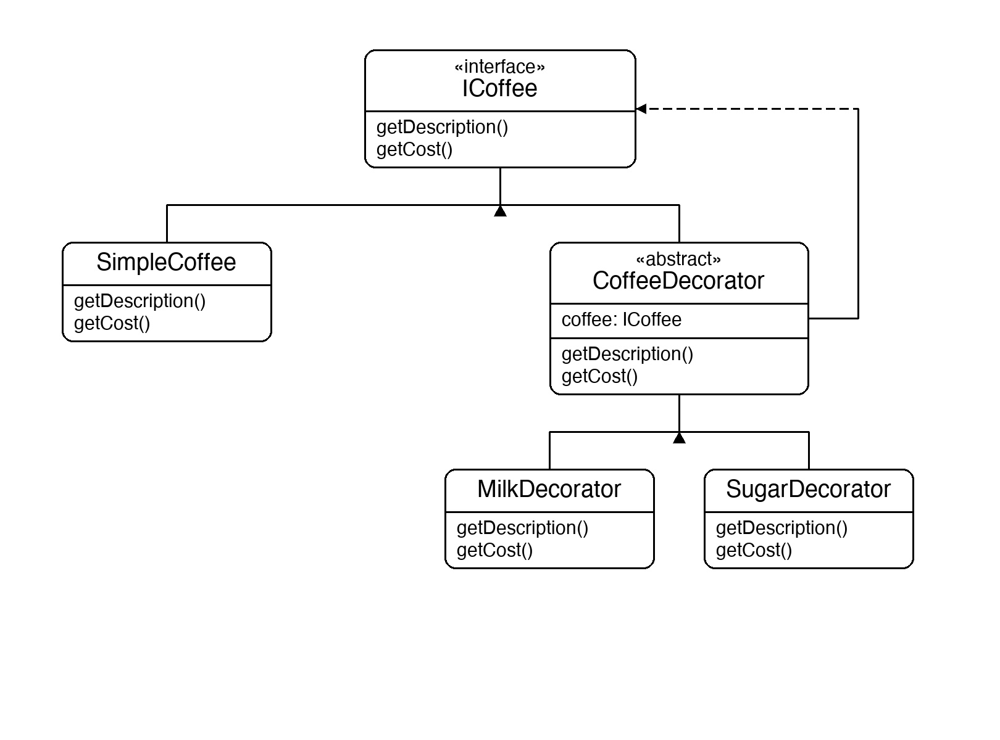

# Documentation of the Code

## Decorator Pattern

The Decorator pattern is a structural design pattern that attaches additional responsibilities to an object dynamically. Decorators provide a flexible alternative to subclassing for extending functionality — you wrap an object in a decorator that adds behaviour, and that decorated object can be wrapped again.

The key mechanism: the decorator implements the same interface as the component it wraps and delegates to it, adding behaviour before or after the delegation. Because both the component and all decorators share the same interface, they are interchangeable from the outside.

This pattern is useful whenever you need to add responsibilities to individual objects without affecting others, or when subclassing would produce an explosion of combinations.

## Classes in the Code:

### Interface ICoffee
The **Component** interface — declares `GetDescription()` and `GetCost()`. Both `SimpleCoffee` and every decorator implement this.

### Class SimpleCoffee
The **Concrete Component** — the base object. Returns `"Simple Coffee"` and `$1.00`.

### Abstract Class CoffeeDecorator
The **Abstract Decorator**. Holds a reference to an `ICoffee` and delegates both methods to it. Subclasses override to add their own contribution.

### Class MilkDecorator
A **Concrete Decorator**. Appends `", Milk"` to the description and adds `$0.25` to the cost.

### Class SugarDecorator
A **Concrete Decorator**. Appends `", Sugar"` to the description and adds `$0.10` to the cost.

### Class Program
The entry point. It starts with a `SimpleCoffee` and wraps it progressively — first with `MilkDecorator`, then `SugarDecorator`, then a second `MilkDecorator` — printing the description and cost after each step. This shows that decorators stack in any order without changing any existing class.

