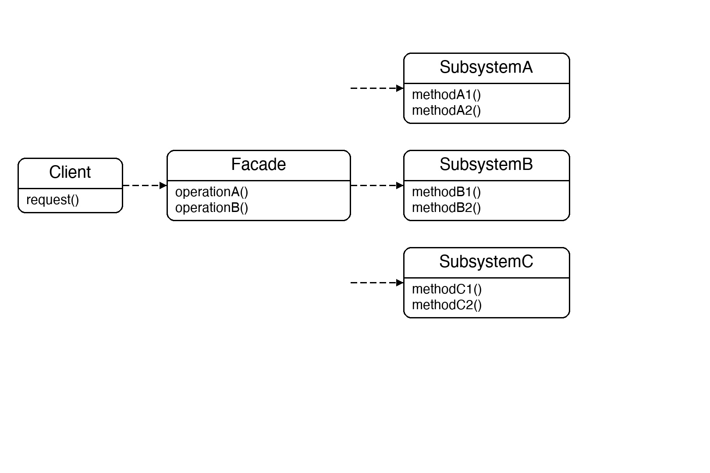
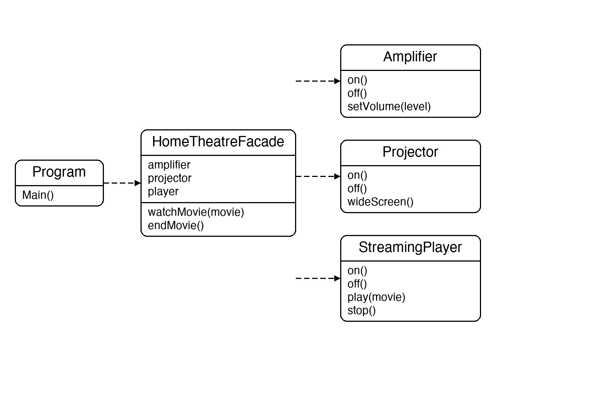

# Documentation of the Code

## Facade Pattern

The Facade pattern is a structural design pattern that provides a simplified interface to a complex subsystem. The facade delegates client calls to the appropriate subsystem objects — the subsystem classes remain accessible directly, but most clients only need the facade.

The key idea is that the facade hides complexity. Rather than making the client coordinate many objects in the right order, the facade encapsulates that coordination behind one or two simple methods.

This pattern is useful whenever a subsystem grows complex, when you want to layer your software so higher-level code depends only on a simple interface, or when you want to decouple clients from implementation details.

## Classes in the Code:

### Class Amplifier
A **Subsystem** class. Controls the amplifier — `On()`, `Off()`, `SetVolume(level)`.

### Class Projector
A **Subsystem** class. Controls the projector — `On()`, `Off()`, `WideScreen()`.

### Class StreamingPlayer
A **Subsystem** class. Controls the streaming player — `On()`, `Off()`, `Play(movie)`, `Stop()`.

### Class HomeTheatreFacade
The **Facade**. Holds references to all three subsystem objects. `WatchMovie` turns on all devices in the correct order; `EndMovie` shuts them all down. The client never needs to know about the individual steps.

### Class Program
The entry point. It creates the three subsystem objects, hands them to `HomeTheatreFacade`, then calls just `WatchMovie` and `EndMovie` — two calls replace ten subsystem calls.

