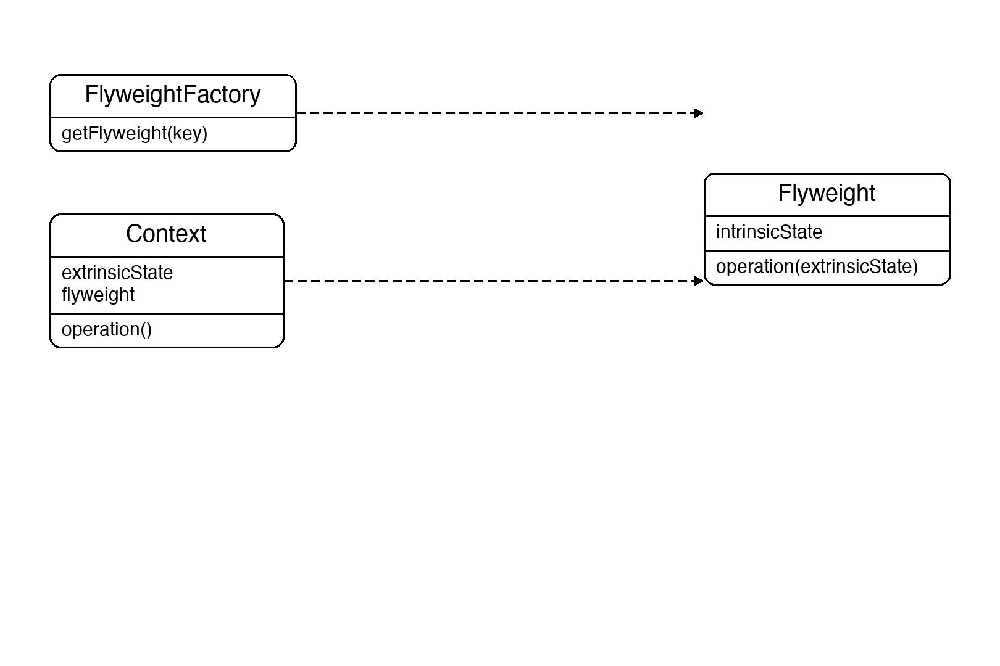
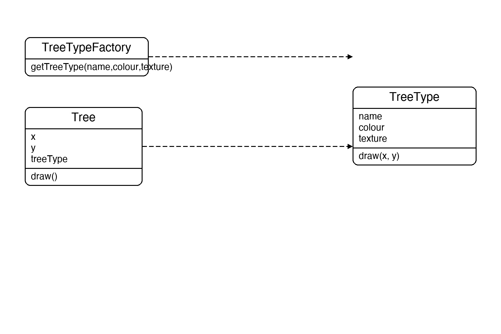

# Documentation of the Code

## Flyweight Pattern

The Flyweight pattern is a structural design pattern that reduces memory usage by sharing as much data as possible between similar objects. Instead of each object storing all its data, shared data is extracted into a separate **flyweight** object that many instances reference.

The key distinction is between:
- **Intrinsic state** — immutable data that is the same across many objects (e.g. tree type, colour, texture). Stored once in the flyweight.
- **Extrinsic state** — data unique to each instance (e.g. position). Stored in the context object and passed to the flyweight at use time.

This pattern is useful whenever a large number of similar objects consumes too much memory — game entities, particles, characters in a text editor, or map tiles.

## Classes in the Code:

### Class TreeType
The **Flyweight**. Holds intrinsic state: `Name`, `Colour`, `Texture`. Its `Draw(x, y)` method accepts extrinsic position data at call time. One `TreeType` instance is shared by many `Tree` objects of the same type.

### Class TreeTypeFactory
The **Flyweight Factory**. Maintains a dictionary cache keyed by `name_colour_texture`. `GetTreeType` returns an existing instance if one matches, or creates and caches a new one. This guarantees sharing.

### Class Tree
The **Context**. Holds extrinsic state (`_x`, `_y`) and a reference to the shared `TreeType`. Its `Draw()` passes the position to the flyweight.

### Class Program
The entry point. It plants 6 trees of only 2 unique types. The factory creates each `TreeType` once, confirming that 6 context objects share only 2 flyweight objects.

