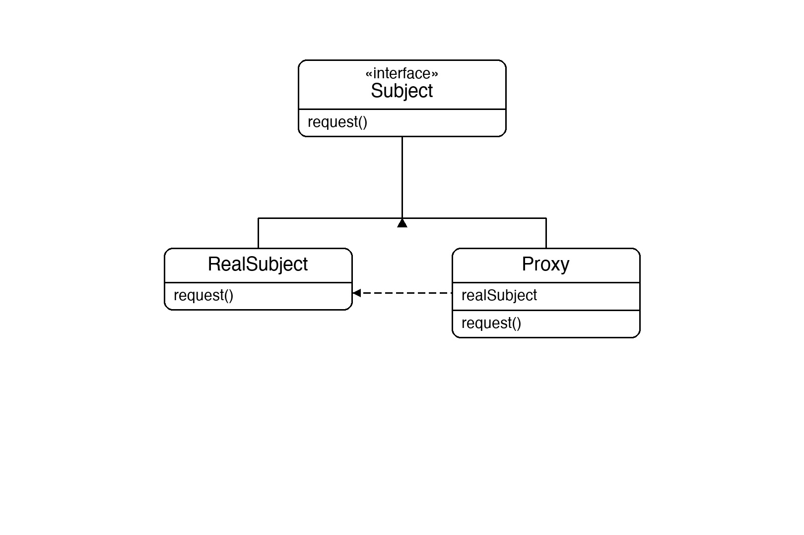
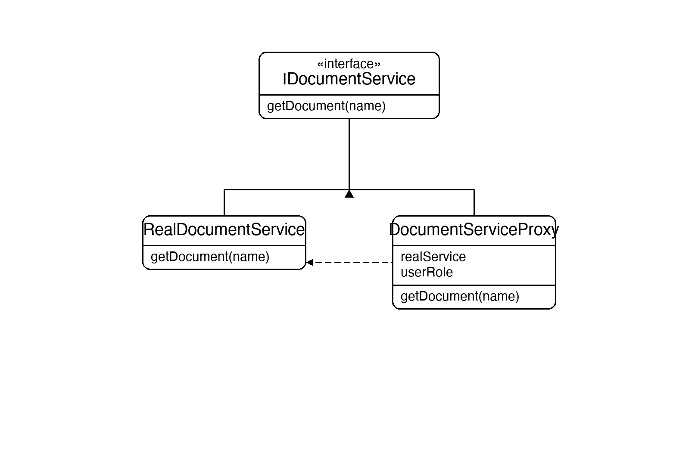

# Documentation of the Code

## Proxy Pattern

The Proxy pattern is a structural design pattern that provides a substitute or placeholder for another object. The proxy controls access to the original object, letting you perform actions before or after the request reaches it.

Common proxy types:
- **Protection proxy** — controls access based on permissions (used here)
- **Virtual proxy** — delays expensive object creation until needed (also shown via lazy init)
- **Remote proxy** — represents an object in a different process or network location
- **Caching proxy** — caches results of expensive operations

The client always talks to the subject interface — it can't tell whether it's holding the real service or a proxy.

## Classes in the Code:

### Interface IDocumentService
The **Subject** interface. Declares `GetDocument(name)`. Both the real service and the proxy implement it, making them interchangeable from the client's perspective.

### Class RealDocumentService
The **Real Subject**. Does the actual work of returning document content. It is only instantiated when an authorised request reaches the proxy (lazy initialisation).

### Class DocumentServiceProxy
The **Proxy**. Implements `IDocumentService` and holds a nullable reference to `RealDocumentService`. Before forwarding a call it checks the user's role — only `Admin` and `Editor` are allowed through. The real service is created lazily using the `??=` operator, so it is never constructed for denied requests.

### Class Program
The entry point. It creates three proxies with different roles (`Admin`, `Editor`, `Guest`) and calls `GetDocument` on each, demonstrating that authorised roles get through while `Guest` is blocked — all through the same interface.

